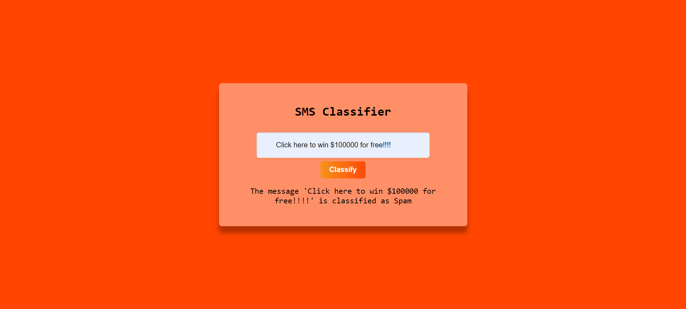

## SMS Spam Classifier

I've built an SMS Spam Classifier using the Naive Bayes Classification model in the SciKit Learn Library.

This Repo consists of :

1. The python notebook where the model has been trained and tested.
2. The End to End application for the user to interact with the model.

This Application was built using Flask, Html and CSS.

To try out the app yourself, clone the repository to your local machine and run the app.py file.

### Sample Output

